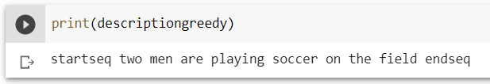

# Image-Captioning-VGG16-LSTM-Beam-Search-
Image Captioning using encoder decoder type model using VGG16, LSTM and beam search

Framework used : Keras
Dataset Used : Flickr8k Dataset
Image Encoder : pretrained VGG16 model with imagenet weights
Sequence Encoder : LSTM
Decoder : Dense Layer with Softmax Activation

Embedding Layer Weights : pretrained GloVE word embeddings

Neural Network Model : 

For Evaluating the model I have used both greedy search as well as beam search to find caption 
as well as using the BLEU score metric to evaluate each search method. Beam search cost has been implemented as a sum of log
of costs with length normalization to account for bias towards short sentences.

After the training I shortlisted the model with weights from epoch 15 and 17.

# BLEU Score for model with weights from epoch 15 : 

1. Greedy Search Evaluation 

2. Beam Search Evaluation ( Beam size = 5 )

# BLEU Score for model with weights from epoch 17 : 

1. Greedy Search Evaluation 

2. Beam Search Evaluation ( Beam size = 5 )

# RESULTS : 

1.

2.

3.

# CONCLUSION : 
It is easy to conclude that beam search evaluation generates better caption in most occassions than greedy search.
While examining the Cost function for beam search and evaluating the results for different values for beam width, It was 
discovered that the cost function is not doing as well as expected and this can be changed by improving the encoder and decoder models.
We can also improve the model by adding Attention Layer.

# REFERENCES : 

1. https://www.coursera.org/learn/nlp-sequence-models
2. https://www.analyticsvidhya.com/blog/2018/04/solving-an-image-captioning-task-using-deep-learning/
3. Oriol Vinyals, Alexander Toshev, Samy Bengio, Dumitru Erhan Show and Tell: A Neural Image Caption Generator

